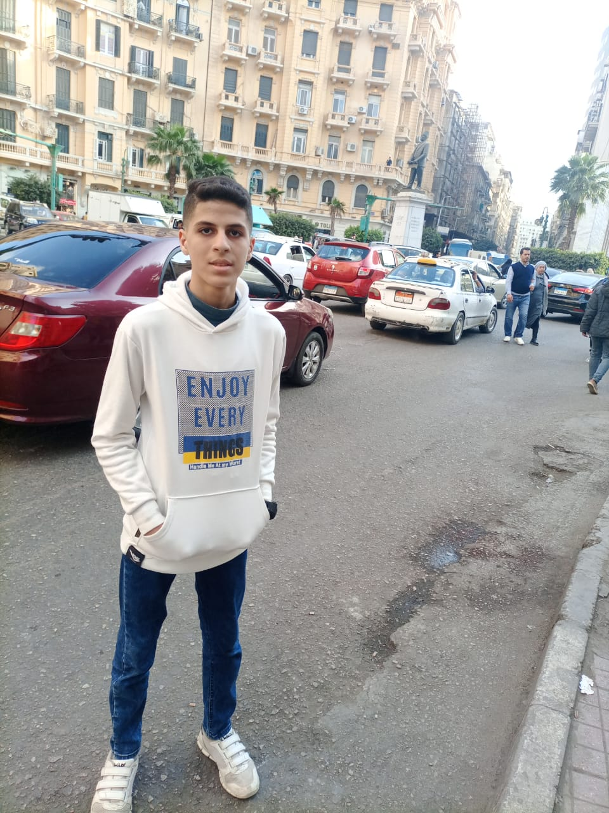

### Hi there 👋

<!--
**MohammedHamdyAllam/MohammedHamdyAllam** is a ✨ _special_ ✨ repository because its `README.md` (this file) appears on your GitHub profile.

Here are some ideas to get you started:

- 🔭 I’m currently working on ...
- 🌱 I’m currently learning ...
- 👯 I’m looking to collaborate on ...
- 🤔 I’m looking for help with ...
- 💬 Ask me about ...
- 📫 How to reach me: ...
- 😄 Pronouns: ...
- ⚡ Fun fact: ...
-->

  
  <h1>Hi 👋, I'm Mohammed Hamdy Allam</h1>
  <h3 class="about">Front-End Developer</h3>
  

